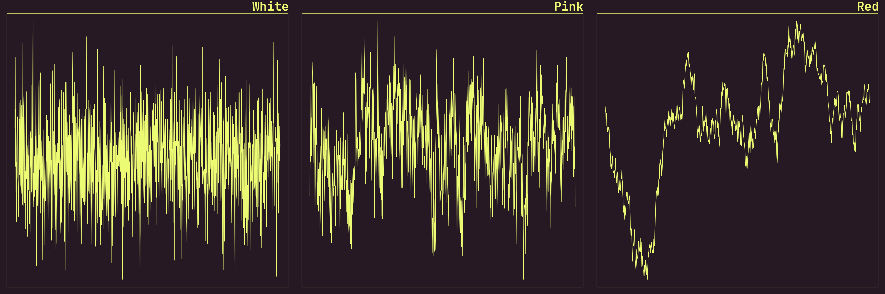
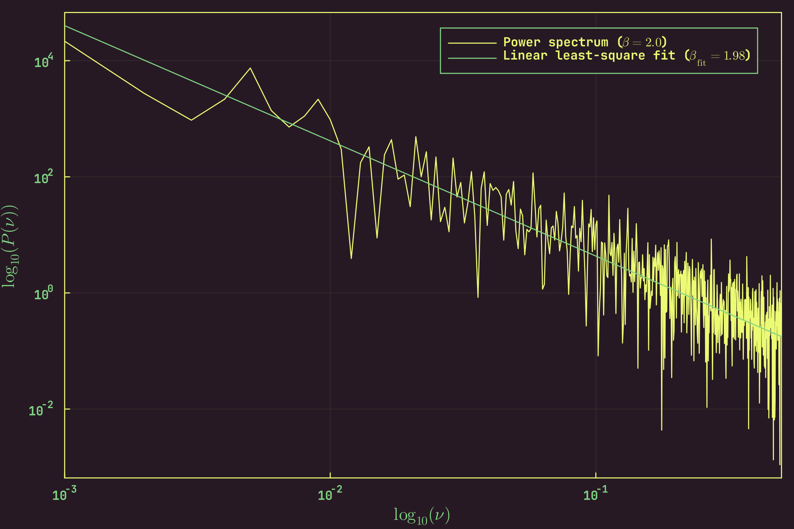

<div align="center">
<h2><code>PowerLawNoise</code></h2>

![License][license]
![GitHub Stars][stars]
[![Gitmoji Badge][gitmoji_badge]][gitmoji]

<br/>
</div>

<div align="justify">

This package implements a novel algorithm, following the work in [**"*On
generating power law noise*", Timmer, J. and Koenig, M., Astron. Astrophys. 300,
707-710 (1995)**][paper], which allows generating power law noise with arbitrary
dimensions and arbitrary exponents. An exponent of $\beta = 0$, $1$ and $2$ corresponds to
white, pink and red noise. The figure below demonstrates the difference between
them, by plotting the resultant time series, generated via `PowerLawNoise.jl`:



Here is another one, but this time we are simulating noise in two dimensions:


We can also go ahead and verify that the algorithm works by performing a linear fit to the logarithmic plot of the power spectrum of the noisy time series generated via `PowerLawNoise.jl`. Here, we do this for the case of red noise (that is, $\beta = 2.0$):



Install it by typing and running:

```bash
] add PowerLawNoise
```

in the Julia REPL.

</div>

[gitmoji]: https://gitmoji.dev
[paper]: https://ui.adsabis.harvard.edu/abs/1995A%26A...300..707T/abstract
[stars]: https://img.shields.io/github/stars/astrogewgaw/PowerLawNoise.jl?style=for-the-badge
[gitmoji_badge]: https://img.shields.io/badge/gitmoji-%20😜%20😍-FFDD67.svg?style=for-the-badge
[license]: https://img.shields.io/github/license/astrogewgaw/PowerLawNoise.jl?style=for-the-badge
