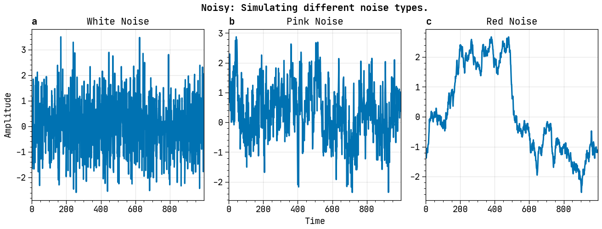
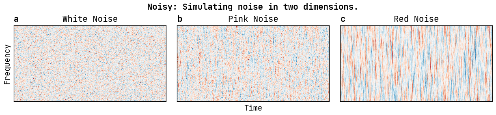

<h2>
<i>
<code>Noisy</code> :
<small><u>Simulating power law noise in Julia.</u></small>
</i>
</h2>

 

![License][license]
![GitHub Stars][stars]
[![Gitmoji Badge][gitmoji_badge]][gitmoji]

 

This package implements a novel algorithm, following the work in [**"*On
generating power law noise*", Timmer, J. and Koenig, M., Astron. Astrophys. 300,
707-710 (1995)**][paper], which allows generating power law noise with arbitrary
dimensions and arbitrary exponents. An exponent of 0, 1 and 2 corresponds to
white, pink and red noise. The figure below demonstrates the difference between
them, by plotting the resultant time series, generated via `Noisy.jl`:

Here is another one, but this time we are simulating noise in two dimensions:

[gitmoji]: https://gitmoji.dev
[paper]: https://ui.adsabis.harvard.edu/abs/1995A%26A...300..707T/abstract
[stars]: https://img.shields.io/github/stars/astrogewgaw/Noisy.jl?style=for-the-badge
[license]: https://img.shields.io/github/license/astrogewgaw/Noisy.jl?style=for-the-badge
[gitmoji_badge]: https://img.shields.io/badge/gitmoji-%20😜%20😍-FFDD67.svg?style=for-the-badge
